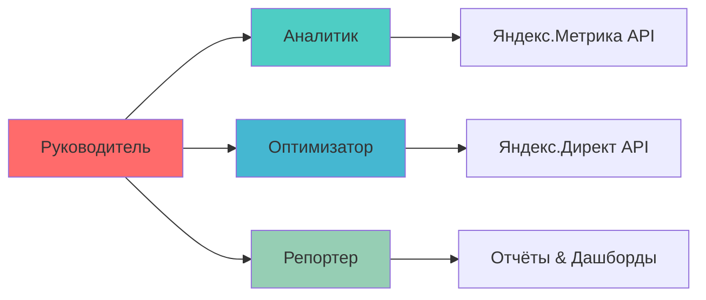

# ИИ-Агент для Маркетинга

Автоматизация работы с Яндекс.Метрикой и Яндекс.Директом

  
    Начать презентацию <carbon:arrow-right class="inline"/>
  

---
layout: two-cols
---

# Проблема

### Маркетологи тратят часы на:

<v-clicks>

- 📊 Сбор данных из разных источников
- 📈 Анализ метрик и конверсий
- 💰 Оптимизацию рекламных кампаний
- 📝 Создание отчётов для руководства
- 🔄 Рутинные операции каждый день

</v-clicks>

::right::

<v-click>

### Последствия

- ⏱️ Потеря времени на рутину
- 💸 Неэффективный расход бюджета
- 🎯 Упущенные возможности
- 😓 Выгорание специалистов

</v-click>

---

# Решение: ИИ-Агент

### Интеллектуальная система на базе CrewAI и FastMCP

<v-clicks>

  <h4>🤖 CrewAI</h4>
  
Оркестрация команды специализированных агентов

  <h4>⚡ FastMCP</h4>
  
Быстрое подключение к внешним сервисам

  <h4>📊 Яндекс.Метрика</h4>
  
Анализ поведения пользователей

  <h4>💰 Яндекс.Директ</h4>
  
Управление рекламными кампаниями

</v-clicks>

---

# Архитектура: Команда Агентов

<v-clicks>

- **Руководитель** — координирует работу команды и принимает решения
- **Аналитик** — собирает и анализирует данные из Метрики
- **Оптимизатор** — управляет кампаниями в Директе
- **Репортер** — генерирует отчёты и инсайты

</v-clicks>

---

# Интеграция: Яндекс.Метрика

### 5 ключевых инструментов для анализа

<v-clicks>

| Инструмент | Функция | Применение |
|-----------|---------|-----------|
| **get_account_info** | Управление счетчиками | Получение списка всех счётчиков |
| **get_traffic_sources_types** | Анализ источников трафика | Оценка эффективности каналов |
| **get_user_demographics** | Демографические данные | Портрет целевой аудитории |
| **get_goals_conversion** | Цели и конверсии | Отслеживание достижений |
| **get_visits** | Реал-тайм аналитика | Мониторинг текущего трафика |

</v-clicks>

<v-click>

💡 <b>Преимущество:</b> Яндекс.Метрика — лидер рынка в России (7% всех сайтов), соответствует ФЗ-152

</v-click>

---

# Интеграция: Яндекс.Директ

### Инструменты для управления рекламой

<v-clicks>

| Инструмент | Функция | Применение |
|-----------|---------|-----------|
| **get_campaigns** | Список кампаний | Обзор всех активных кампаний |
| **get_campaign_stats** | Статистика кампаний | CTR, CPC, конверсии, ROI |
| **update_bid_modifiers** | Корректировки ставок | Оптимизация по устройствам/гео |
| **pause_keywords** | Управление ключами | Остановка неэффективных слов |
| **get_budget_forecast** | Прогноз бюджета | Планирование расходов |

</v-clicks>

<v-click>

🎯 <b>Синергия:</b> Данные из Метрики используются для оптимизации кампаний в Директе

</v-click>

---

# Сценарии Работы

<v-clicks>

### 🔄 Ежедневная оптимизация

1. Анализ вчерашних данных
2. Выявление неэффективных кампаний
3. Корректировка ставок и бюджетов
4. Отчёт о изменениях

### 📊 Недельный отчёт

1. Сбор данных за неделю
2. Анализ трендов и аномалий
3. Сегментация аудитории
4. Рекомендации по улучшению

### 🎯 Аудит целевой аудитории

1. Демографический анализ
2. Карта источников трафика
3. Поведенческие паттерны
4. Персонализация стратегии

### 💰 Оптимизация ROI

1. Расчёт ROMI по кампаниям
2. Перераспределение бюджета
3. A/B тесты объявлений
4. Прогноз эффективности

</v-clicks>

---

# Преимущества Решения

<v-clicks>

  
⚡

  <h4>Скорость</h4>
  
Анализ за минуты вместо часов

  
🎯

  <h4>Точность</h4>
  
Решения на основе данных, без эмоций

  
💰

  <h4>Экономия</h4>
  
-30% расходов на рекламу

  
📈

  <h4>Масштаб</h4>
  
Управление 100+ кампаниями

  
🔄

  <h4>Автоматизация</h4>
  
Работа 24/7 без выходных

  
🧠

  <h4>Обучение</h4>
  
Улучшение с каждым анализом

</v-clicks>

---

# Рыночный Контекст

### 📊 Лидеры рынка в России

<v-clicks>

- **Яндекс.Метрика** — 7% всех сайтов
- **Roistat** — 30,000+ компаний
- **Matomo** — 0.4% сайтов
- **OWA** — 19 сайтов

</v-clicks>

### 🎯 Наше позиционирование

<v-clicks>

- Работа с лидером рынка
- Соответствие ФЗ-152
- Интеграция с экосистемой Яндекса
- ИИ-автоматизация рутины

</v-clicks>

<v-click>

### 🔥 Тренд: Рост спроса на российские решения

После ограничений Google Analytics в 2025 году компании активно переходят на локальные платформы

</v-click>

---
layout: center
class: text-center
---

# Начните Автоматизацию Сегодня

<v-clicks>

### 🚀 Внедрение за 3 шага

1. **Подключение API** — интеграция с Метрикой и Директом
2. **Настройка агентов** — конфигурация под ваши KPI
3. **Запуск автоматизации** — первые результаты через 24 часа

  <a href="mailto:contact@example.com" class="px-6 py-3 bg-blue-500 rounded-lg text-white hover:bg-blue-600">
    Связаться с нами
  </a>

</v-clicks>

---
layout: end
---

# Спасибо за внимание!

### Вопросы?

**Технологии:** CrewAI • FastMCP • Яндекс.Метрика API • Яндекс.Директ API

**Преимущества:** Автоматизация • Экономия времени • Рост эффективности

