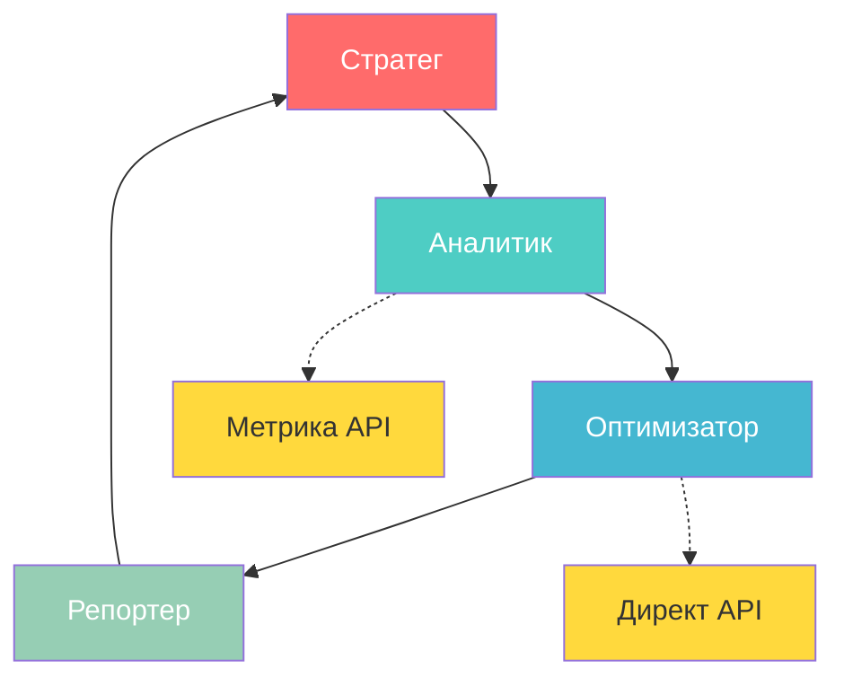

# Мультиагентная Система для Маркетинга

Команда ИИ-агентов для работы с Яндекс.Метрикой и Яндекс.Директом

  
    Начать презентацию <carbon:arrow-right class="inline"/>
  

  NNSTD: cloud-ru-hack-2025

---
layout: two-cols
---

# Проблема

### Маркетологи тратят часы на:

<v-clicks>

- 📊 Сбор и анализ данных из Метрики
- 💰 Оптимизацию рекламных кампаний
- 📈 Расчёт ROAS, CPA, LTV
- 📝 Создание отчётов для руководства
- 🔄 Координацию между разными задачами

</v-clicks>

::right::

<v-click>

### Последствия

- ⏱️ 40+ часов в неделю на рутину
- 💸 Неоптимальный расход бюджета
- 🎯 Запаздывание реакции на изменения
- 😓 Человеческий фактор в решениях
- 🔀 Потеря данных между системами

</v-click>

---

# Рыночный Контекст

  <a href="https://github.com/NNSTD-cloud-ru-hack-2025/analytic-docs/blob/main/docs/market-analysis.md" target="_blank" class="text-blue-500 hover:text-blue-600">
    🔗 Анализ рынка
  </a>

### 📊 Лидеры рынка в России

<v-clicks>

- **Яндекс.Метрика** — 7% всех сайтов
- **Roistat** — 30,000+ компаний
- **Matomo** — 0.4% сайтов
- **OWA** — 19 сайтов

</v-clicks>

### 🎯 Наше позиционирование

<v-clicks>

- Работа с лидером рынка
- Соответствие ФЗ-152
- Интеграция с экосистемой cloud.ru
- Мультиагентная архитектура
- Стратегия основанная на данных

</v-clicks>

<v-click>

### 🔥 Тренд: Рост спроса на российские решения

После ограничений Google Analytics в 2025 году компании активно переходят на локальные платформы. Мультиагентные системы на базе российских сервисов — решение будущего.

</v-click>

---

# Решение: Мультиагентная Команда

  <a href="https://github.com/NNSTD-cloud-ru-hack-2025/agent" target="_blank" class="text-blue-500 hover:text-blue-600">
    🔗 https://github.com/NNSTD-cloud-ru-hack-2025/agent
  </a>

<v-clicks>

### 🎯 Ключевые роли

- **Стратег** — задаёт направление
- **Аналитик** — собирает данные
- **Оптимизатор** — управляет кампаниями
- **Репортер** — отчёты и коммуникация

### 🔄 Непрерывный цикл

Планирование → Анализ → Оптимизация → Отчётность → Корректировка

</v-clicks>

---

# Роли Агентов

### Первая Очередь

<v-clicks>

  <h3 class="text-base font-bold">🎯 Стратег</h3>
  <ul class="text-xs mt-2 space-y-1">
    <li>Анализ бизнес-целей</li>
    <li>Маркетинговая стратегия</li>
    <li>Распределение бюджета</li>
    <li>Приоритетные сегменты</li>
  </ul>

  <h3 class="text-base font-bold">📊 Аналитик</h3>
  <ul class="text-xs mt-2 space-y-1">
    <li>Сбор данных (API)</li>
    <li>Паттерны поведения</li>
    <li>ROAS, CPA, LTV</li>
    <li>Дашборды и инсайты</li>
  </ul>

  <h3 class="text-base font-bold">⚡Оптимизатор</h3>
  <ul class="text-xs mt-2 space-y-1">
    <li>Настройка кампаний</li>
    <li>A/B-тестирование</li>
    <li>Управление ретаргетингом</li>
    <li>Оптимизация бюджета</li>
  </ul>

  <h3 class="text-base font-bold">📝 Репортер</h3>
  <ul class="text-xs mt-2 space-y-1">
    <li>Регулярные отчёты</li>
    <li>Визуализация данных</li>
    <li>Презентации</li>
    <li>Координация команды</li>
  </ul>

</v-clicks>

### Вторая Очередь

<v-clicks>

  <h3 class="text-base font-bold">✍️ Контент-менеджер</h3>
  <ul class="text-xs mt-3 space-y-1">
    <li>Генерация текстов объявлений</li>
    <li>Подбор креативов под аудитории</li>
    <li>Обновление UVP на основе данных</li>
    <li>Контроль соответствия контента</li>
  </ul>

  <h3 class="text-base font-bold">🔧 Технический интегратор</h3>
  <ul class="text-xs mt-3 space-y-1">
    <li>Настройка целей в Метрике</li>
    <li>Проверка UTM-меток и трекинга</li>
    <li>Интеграция с CRM-системами</li>
    <li>Мониторинг технических ошибок</li>
  </ul>

</v-clicks>

<v-click>

💡 <b>Расширяемость:</b> Команда может масштабироваться под специфические задачи бизнеса

</v-click>

---

# MCP-инструменты: Яндекс.Метрика

  <a href="https://github.com/NNSTD-cloud-ru-hack-2025/ymetrika-mcp" target="_blank" class="text-blue-500 hover:text-blue-600">
    🔗 https://github.com/NNSTD-cloud-ru-hack-2025/ymetrika-mcp
  </a>

<v-clicks>

| Инструмент | Функция | Кто использует |
|-----------|---------|----------------|
| **get_account_info** | Информация о счетчике | Стратег, Аналитик |
| **get_visits** | Статистика визитов и просмотров | Аналитик, Репортер |
| **get_traffic_sources** | Анализ источников трафика | Аналитик, Стратег |
| **get_user_demographics** | Демография (пол, возраст) | Стратег, Контент-менеджер |
| **get_goals_conversion** | Цели и конверсии | Аналитик, Оптимизатор |

</v-clicks>

<v-click>

  

    📊 <b>Комплексность:</b> Полный цикл анализа
  

  

    🎯 <b>Точность:</b> Решения на основе фактов
  

</v-click>

---

# MCP-инструменты: Яндекс.Директ

  <a href="https://github.com/NNSTD-cloud-ru-hack-2025/ydirect-mcp" target="_blank" class="text-blue-500 hover:text-blue-600">
    🔗 https://github.com/NNSTD-cloud-ru-hack-2025/ydirect-mcp
  </a>

<v-clicks>

| Инструмент | Функция | Кто использует |
|-----------|---------|----------------|
| **get_campaign_list** | Список кампаний (ID, статус) | Стратег, Аналитик, Оптимизатор |
| **get_campaign_statistics** | Показы, клики, CTR, расходы | Аналитик, Репортер, Стратег |
| **get_keyword_performance** | Статистика по ключевым словам | Оптимизатор, Аналитик |
| **manage_campaign_status** | Запуск/остановка кампаний | Оптимизатор |
| **get_account_balance** | Баланс и расходы аккаунта | Стратег, Репортер |

</v-clicks>

<v-click>

  

    ⚡ <b>Оперативность:</b> Быстрое реагирование
  

  

    💰 <b>Контроль:</b> Прозрачность бюджета
  

</v-click>

---

# Демонстрация Работы

  <video controls class="w-full max-h-80">
    <source src="/demo/demo.mp4" type="video/mp4">
    Your browser does not support the video tag.
  </video>

  <a href="https://github.com/NNSTD-cloud-ru-hack-2025/analytic-docs/raw/refs/heads/main/demo/demo.mp4" target="_blank" class="text-blue-500 hover:text-blue-600">
    🔗 Прямая ссылка на видео
  </a>

---

# Пример Отчета

### Общая информация о проекте

- **Счетчик Яндекс.Метрики**: 57089593
- **Название**: eng-blog
- **URL сайта**: gainanov.pro/eng-blog/
- **Статус**: Активный
- **Владелец**: GRomRX1
- **Период анализа**: Последние 7 дней (05.12.2025 - 12.12.2025)

  <a href="https://github.com/NNSTD-cloud-ru-hack-2025/analytic-docs/blob/main/demo/detail_report_2025.md" target="_blank" class="px-4 py-2 bg-blue-500 text-white rounded hover:bg-blue-600 transition">
    📄 Скачать полный отчет
  </a>

---
layout: center
class: text-center
---

# Начните Автоматизацию Сегодня

<v-clicks>

### 🚀 Внедрение в 4 этапа

<b>1. Интеграция API</b> 
Подключение Метрики и Директа через MCP

<b>2. Настройка агентов</b> 
Конфигурация команды под ваши KPI

<b>3. Обучение системы</b> 
Загрузка исторических данных

<b>4. Запуск автоматизации</b> 
Первые результаты через 24 часа

  <a href="mailto:gromrx1@gmail.com" class="px-6 py-3 bg-blue-500 rounded-lg text-white hover:bg-blue-600">
    Связаться с нами
  </a>

</v-clicks>

---
layout: end
---

# Спасибо за внимание!

### Вопросы?

**Технологии:** cloud.ru • CrewAI • FastMCP • Яндекс.Метрика • Яндекс.Директ

**Агенты:** Стратег • Аналитик • Оптимизатор • Репортер

**Преимущества:** Мультиагентная координация • Непрерывность оптимизация • Полная автоматизация

